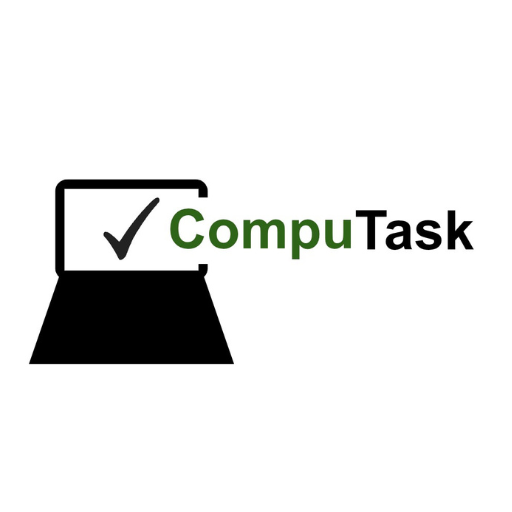

  

# CompuTask

**CompuTask is a simple, lightweight, and offline task manager focused on clarity and stability.**

It was designed to work reliably on both modern and legacy systems, without accounts, sync or unnecessary features.

## Features

- Simple task list
- Mark tasks as completed
- Persistent storage using a local JSON file
- Lightweight graphical interface (Tkinter)
- No internet connection required

## Platforms 

- Linux (AppImage)
- Windows (exe)

Tested on:
- Linux Mint / Ubuntu-based systems
- Windows 7 (legacy)
- Windows 10 / 11

## Usage

Just run the application. Tasks are saved automatically in a local file (`tarefas.json`)

## Philosophy

CompuTask values:
- usability over complexity
- local data over cloud dependence
- longevity over trends

## License

MIT License
